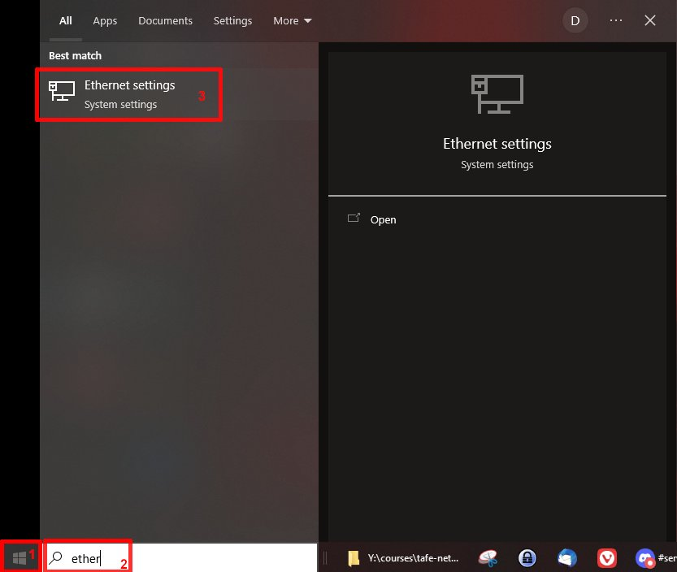
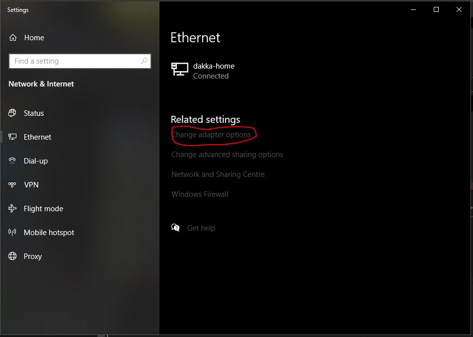
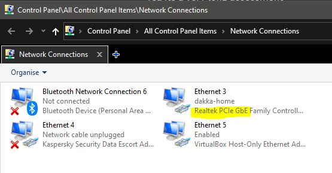
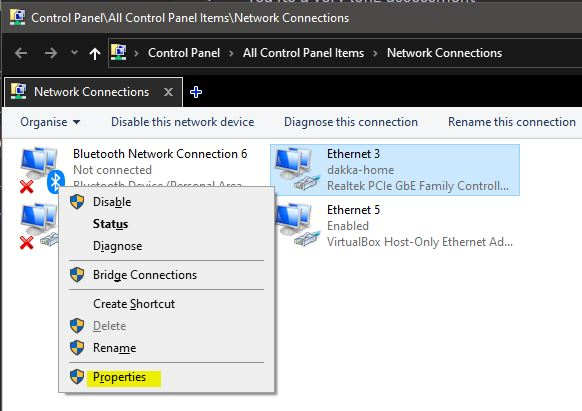
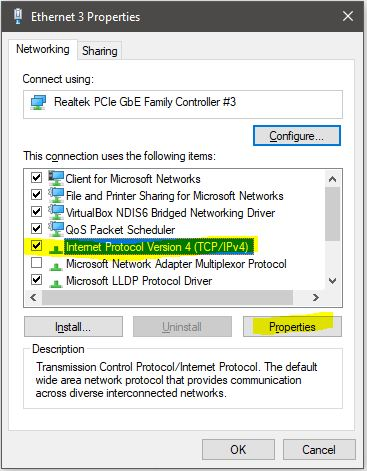
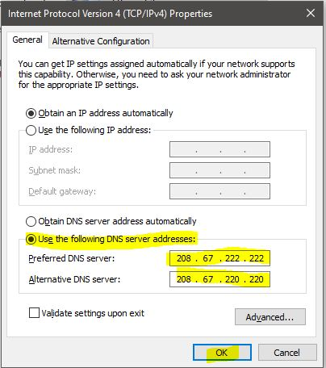
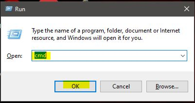
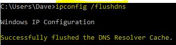

1. Click on Start Menu
2. type Ether
3. Select: Ethernet Settings

1. On the right hand side select: Change adapter options

1. Find your network adapter. It should say Ethernet \[number\] and below that you should see your home network and then below that your Driver. In most cases it will be a Realtek, Ignore bluetooth, or Virtualbox etc.

1. Right click on the adapter and select properties

1. Find: Internet Protocol Version 4 (TCP/IPv4) and select it. Then click on properties

#### **__!!!VERY IMPORTANT!!! - Make sure you take a screen shot or write down all your settings here. You want to put them all back when you are done!!!__**

1. **Only change the bottom part where it says: Use the following DNS server addresses:**

Use the same IP addresses I have below. If you are lazy you can just use 1. Make sure you note down what you had before so you can put it back.

Press OK

1. Start the command prompt: Hold down the Windows-Key and tap R
2. This brings up the run dialogue. Then type cmd and click ok

1. Finally flush your dns cache by typing: ipconfig /flushdns  
   Then press Enter

1. **__Once you finish the assessment questions for openDNS revert the network adapter settings, hopefully all you need to do is put your original DNS server back in. Then flush your DNS cache again.__**